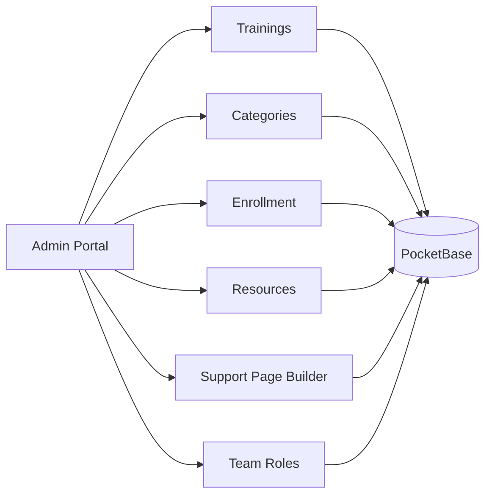
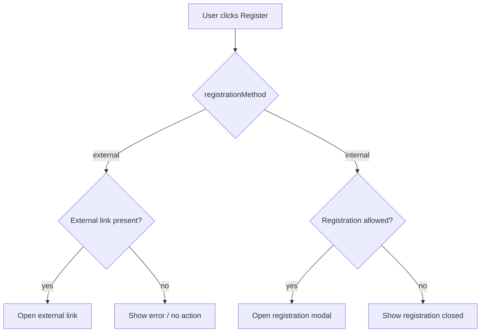
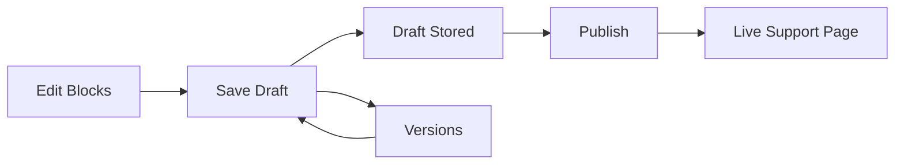

# Admin User Guide

This guide explains how to use the admin portal to manage trainings, enrollments, resources, and support content.

## Access and Roles

- Admin access is granted via `users.role = "admin"` in PocketBase.
- Standard users have read-only access and can register for trainings.
- The app typically uses SSO; the `/whoami` endpoint returns SSO identity, and users are automatically created in PocketBase.
- Optional local admin login is available at `/admin-login` when `VITE_ENABLE_ADMIN_LOGIN=true`.

If you see an "Access denied" screen, your account does not have the `admin` role yet.

### User Provisioning

SSO users are automatically created in PocketBase on their first login with a default `role='user'`. This happens transparently via frontend logic:
- Email from SSO is the unique identifier
- New users get `role='user'` by default
- Existing users are never updated (preserves manual role changes)
- All users appear in the Team Roles tab after first login

To grant admin access, you must manually change the user's role to `'admin'` in the Team Roles tab.

## Admin Portal Overview

Open `/admin` to access the admin portal. Tabs include:

- Dashboard
- Trainings
- Categories
- Enrollment
- Resources
- Support Page
- Team Roles

Mermaid diagram: portal modules and data flow.

## Trainings

Use this tab to create and manage training sessions.

### Create a Training

1. Go to `/admin` and open the "Trainings" tab.
2. Click "Add Training".
3. Complete the multi-step form.

Form steps and key fields:

1. Basic Details
2. Schedule
3. Capacity
4. Instructors
5. Enrollment Rules

### Edit or Delete a Training

1. In the Trainings list, use the edit action to modify a training.
2. Use the delete action to remove a training.

Note: Deleting a training also removes it from the user-facing pages.

### Validation Rules and Limits

- Name: required, max 200 characters.
- Description: max 5000 characters.
- Short description: max 300 characters.
- Category: required.
- External link: must start with `https://`.
- Available slots: integer, min 0, max 10,000.
- Max registrations: integer, min 1, max 10,000.
- Hero image: JPEG, PNG, GIF, WebP, max 5MB.
- Attachments: PDF, Word, Excel, PowerPoint, max 5MB per file.

### Training Attributes

- Status values: `Scheduled`, `Rescheduled`, `In Progress`, `On Hold`, `Cancelled`, `Completed`.
- Registration methods: `internal` or `external`.
- Target audience options:
  - `General`
  - `Specialist and Below`
  - `Senior Specialist and Above`
  - `Managers and Above`
  - `Directors and Above`

### Featured and Recommended

- Mark trainings as "Featured" to show them in the homepage hero slider.
- Mark trainings as "Recommended" to populate the recommended section.

### Registration Behavior

Registration is allowed only when all of the following are true:

- `Registration Open` is enabled.
- Status is not `Completed`, `Cancelled`, or `On Hold`.
- `Available Slots` is greater than `0`.

If `registrationMethod` is `external`, users are sent to the external link.
If `registrationMethod` is `internal`, users see the built-in registration form.

Mermaid diagram: registration decision flow.

## Categories

Create and manage training categories used for filtering and badges.

Steps:

1. Go to the "Categories" tab.
2. Add or edit a category name and color.
3. Save the category.

Rules:

- Name is required, max 100 characters.
- Color must be a valid hex color, for example `#3b82f6`.

Impact:

- Categories appear as badges on cards and detail pages.
- Category filters drive the calendar and training list filtering.

## Enrollment

Manage registrations across trainings.

### Common Workflows

- Search by participant name or email.
- Filter by status, attendance, training, or category.
- Select multiple rows and use bulk actions.
- Export filtered results to CSV or XLSX.

### Enrollment Statuses

- `registered`
- `pending_approval`
- `hr_approval`
- `confirmed`
- `cancelled`
- `on_hold`
- `waitlisted`

### Attendance Statuses

- `pending`
- `attended`
- `no_show`

### Exporting

- Use CSV for lightweight reporting.
- Use XLSX for spreadsheets with better formatting.

## Resources (Tools & Guidelines)

Manage documents and links shown on the Tools & Guidelines page (`/tools`).

### Create or Edit a Resource

1. Go to the "Resources" tab.
2. Add a title and select a type.
3. Provide an external link and/or upload a file.
4. Save.

Rules:

- Resource types: `Guideline`, `User Guide`, `Template`, `FAQ`.
- External links must start with `https://`.
- File uploads: PDF, Word, Excel, PowerPoint, max 5MB.

Behavior:

- If both a link and a file exist, users will see the appropriate action.
- Replacing a file removes the old file reference in the UI.

## Support Page Builder

The Support page (`/support`) is rendered from blocks created in the page builder.

### Add Content

1. Go to the "Support Page" tab.
2. Add blocks using the available types.
3. Save as draft or publish.

Block types:

- Heading
- Paragraph
- Link/Button
- Row Layout
- Divider
- Spacer
- Icon Card

### Draft vs Publish

- "Save Draft" stores changes without showing them publicly.
- "Publish" makes the content live on the Support page.
- "Versions" lets you restore a previous version.

Mermaid diagram: support page publishing flow.

## Team Roles

Manage roles for users stored in PocketBase.

### Assign Roles

1. Go to the "Team Roles" tab.
2. Search for the user by name or email.
3. Set role to `admin` or `user`.

Notes:

- Removing admin access sets the role back to `user`.
- For full user deletion, use the PocketBase admin dashboard.

### Auto-Provisioned Users

All SSO users are automatically created in PocketBase on first login. You'll see them appear in the Team Roles list after they log in for the first time.

**Important Notes**:
- Users are matched by email address
- New users always start with `role='user'`
- Changing a role here is permanent until you change it again
- SSO role data is ignored; roles are managed exclusively in this interface
- The first admin must be created manually via PocketBase admin UI at `https://training-hub.ku.ac.ae/_/`

## Troubleshooting

- Access denied: ensure the user has `role = "admin"` in PocketBase.
- External link errors: links must start with `https://`.
- Upload failures: verify file type and size (5MB max).
- Support page not showing: ensure content is published, not just saved as draft.
- Registration blocked: check status, slots, and `Registration Open`.
- User not appearing in Team Roles: user must login at least once for auto-provisioning to create their account.
- Cannot find PocketBase admin UI: access via `https://training-hub.ku.ac.ae/_/` (not `http://127.0.0.1:8090/_/`).
- User shows wrong role: roles are managed manually via Team Roles tab, not synced from SSO.
